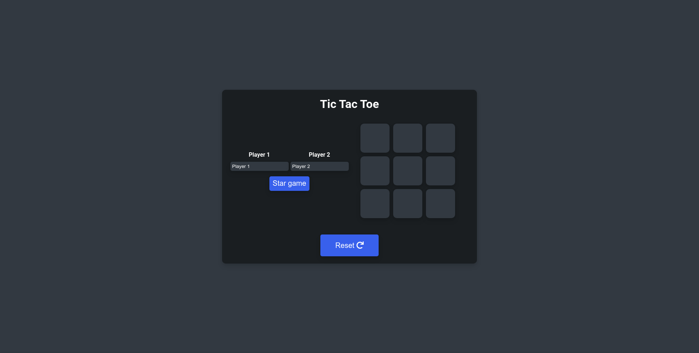
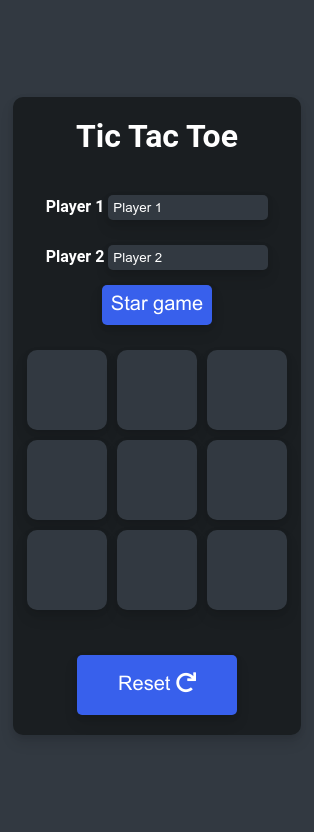

# Tic Tac Toe

This is a Tic-Tac-Toe game you can play in your browser.

## Motivation

The idea of this project came from [The Odin Project](https://www.theodinproject.com/).

Things I learned while I was doing this project:

```
- Factory functions
- Module patterns
- Private variables and functions
- closures
```

## Features

- Beautiful UI
  

- Responsive design
  

## Technologies

This project was created with:

- HTML.
- Vanilla CSS.
- Mobile first approach.
- Vanilla Javascript.

## Credits

Made with :blue_heart: by me (and too much effort).
